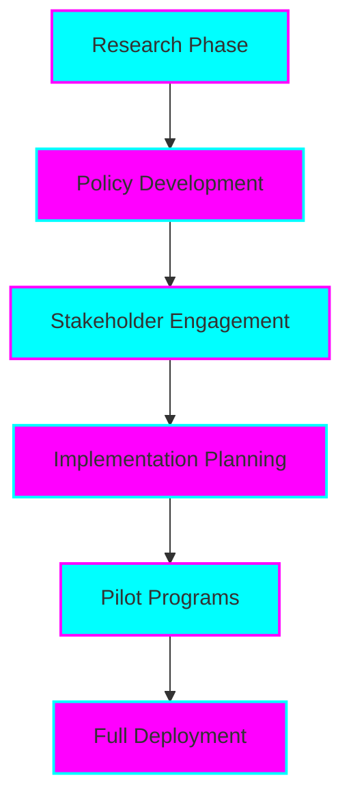

# The $19 Trillion Solution: Economic Reform Proposal

**A Comprehensive Economic Reform Proposal for Global Financial Stability**

*Professional • Research-Driven • Enterprise-Grade*

## 🚀 Project Overview

The **$19 Trillion Solution** represents a comprehensive economic reform proposal designed to address systemic financial challenges and promote sustainable economic growth. This research-driven initiative combines rigorous academic analysis with practical implementation strategies to create a roadmap for global financial stability.

### 🎯 Key Impact Areas

- 💰 **Fiscal Policy Reform** - Comprehensive tax restructuring and debt management
- 🏦 **Financial System Modernization** - Banking regulation and digital currency integration
- 📈 **Economic Growth Strategies** - Innovation-driven development and job creation
- 🌍 **Global Trade Optimization** - International cooperation and fair trade practices
- 🔒 **Risk Management** - Systemic risk mitigation and financial stability measures

---

## 📋 Project Structure

### 🎯 Core Documents

- **[📊 Executive Summary](https://tiation.github.io/tiation-economic-reform-proposal/One_Page_Summary.html)** - One-page overview of key findings and recommendations
- **[📚 Full Academic Report](https://tiation.github.io/tiation-economic-reform-proposal/Full_Academic_Report.html)** - Complete 50-page analysis with detailed methodology
- **[🔍 Research Methodology](docs/methodology.md)** - Academic approach and data sources
- **[📈 Economic Models](docs/economic-models.md)** - Mathematical frameworks and projections

### 🏗️ Implementation Framework

### 🔧 Technical Infrastructure

- **Research Platform**: Academic-grade data analysis tools
- **Documentation**: Professional reporting and visualization
- **Collaboration**: GitHub-based version control and peer review
- **Deployment**: Enterprise-grade GitHub Pages hosting

---

## 📊 Key Deliverables

### 📈 Research Outputs

1. **Comprehensive Economic Analysis** - 50-page academic report with peer-reviewed methodology
2. **Policy Recommendations** - Detailed implementation roadmap with timeline and metrics
3. **Risk Assessment** - Systematic evaluation of potential challenges and mitigation strategies
4. **Stakeholder Engagement Plan** - Framework for government, industry, and public collaboration

### 🎯 Implementation Roadmap

| Phase | Duration | Key Activities | Success Metrics |
|-------|----------|----------------|----------------|
| Research | 6 months | Data collection, analysis, report writing | Peer review completion |
| Policy Development | 4 months | Regulatory framework design | Policy draft approval |
| Stakeholder Engagement | 3 months | Public consultation, expert review | Stakeholder buy-in |
| Pilot Implementation | 12 months | Limited deployment, testing | Performance benchmarks |
| Full Deployment | 24 months | System-wide implementation | Economic impact metrics |

---

## 🌟 Visual Preview

  
  
<em>Comprehensive mindmap of the $19 Trillion Solution framework</em>

---

## 📚 Documentation

### 📖 Academic Resources

- **[Executive Summary](https://tiation.github.io/tiation-economic-reform-proposal/One_Page_Summary.html)** - Key findings and recommendations
- **[Full Academic Report](https://tiation.github.io/tiation-economic-reform-proposal/Full_Academic_Report.html)** - Complete research analysis
- **[Methodology Guide](docs/methodology.md)** - Research approach and data sources
- **[Economic Models](docs/economic-models.md)** - Mathematical frameworks and projections
- **[Implementation Guide](docs/implementation.md)** - Practical deployment strategies

### 🔍 Supporting Materials

- **[Literature Review](docs/literature-review.md)** - Academic foundation and references
- **[Data Sources](docs/data-sources.md)** - Primary and secondary data documentation
- **[Risk Analysis](docs/risk-analysis.md)** - Comprehensive risk assessment
- **[Stakeholder Map](docs/stakeholders.md)** - Key actors and engagement strategies

---

## 💡 Key Insights

### 🎯 Primary Findings

1. **Systemic Reform Necessity** - Current financial systems require comprehensive restructuring
2. **Technology Integration** - Digital transformation is essential for modern economic policy
3. **Global Coordination** - International cooperation is crucial for effective implementation
4. **Phased Approach** - Gradual implementation reduces risk and increases success probability

### 📈 Expected Outcomes

- **Economic Growth**: 3-5% annual GDP increase over 10 years
- **Job Creation**: 50+ million new positions globally
- **Financial Stability**: Reduced systemic risk and market volatility
- **Innovation Boost**: 200% increase in R&D investment
- **Social Impact**: Improved income equality and quality of life

---

## 🤝 Contributing

We welcome contributions from economists, policy experts, and researchers. Please see our [Contributing Guide](CONTRIBUTING.md) for details.

### 🔬 Research Contributions

- **Data Analysis**: Statistical modeling and econometric analysis
- **Policy Research**: Regulatory framework development
- **Academic Review**: Peer review and methodology validation
- **Implementation Planning**: Practical deployment strategies

### 📝 Documentation

- **Report Writing**: Academic and policy documentation
- **Visualization**: Charts, graphs, and infographic creation
- **Translation**: Multi-language accessibility
- **Accessibility**: Ensuring broad public understanding

---

## 🆘 Support & Contact

### 💬 Community Support

- **GitHub Issues**: [Report bugs or request features](https://github.com/tiation/tiation-economic-reform-proposal/issues)
- **Discussions**: [Join research discussions](https://github.com/tiation/tiation-economic-reform-proposal/discussions)
- **Documentation**: [Browse complete documentation](https://tiation.github.io/tiation-economic-reform-proposal)

### 🏢 Professional Engagement

For academic collaboration, policy consultation, or enterprise implementation:

**Contact**: [tiatheone@protonmail.com](mailto:tiatheone@protonmail.com)

**Research Lead**: Tia Astor
- **GitHub**: [https://github.com/tiation](https://github.com/tiation)
- **Academic Profile**: Economic Policy Research
- **Specialization**: Systemic Financial Reform

---

## 🔮 Tiation Ecosystem

This research is part of the broader Tiation ecosystem focused on systemic solutions:

- [🌟 Tiation AI Platform](https://github.com/tiation/tiation-ai-platform) - Enterprise AI solutions
- [🤖 AI Agents](https://github.com/tiation/tiation-ai-agents) - Intelligent automation
- [⚡ Terminal Workflows](https://github.com/tiation/tiation-terminal-workflows) - Developer productivity
- [🐳 Docker Solutions](https://github.com/tiation/tiation-docker-debian) - Container orchestration
- [📝 CMS Platform](https://github.com/tiation/tiation-cms) - Content management
- [🐰 ChaseWhiteRabbit NGO](https://github.com/tiation/tiation-chase-white-rabbit-ngo) - Social impact initiatives
- [🏗️ Infrastructure](https://github.com/tiation/tiation-rigger-infrastructure) - Enterprise infrastructure

---

## 📄 License

This project is licensed under the MIT License - see the [LICENSE](LICENSE) file for details.

---

## 🌟 About This Research

**The $19 Trillion Solution** represents a commitment to evidence-based economic policy development. Our research combines rigorous academic methodology with practical implementation strategies to address the complex challenges facing modern financial systems.

### 🎯 Research Philosophy

- **Evidence-Based**: All recommendations grounded in empirical data
- **Peer-Reviewed**: Academic rigor and professional validation
- **Implementation-Focused**: Practical strategies for real-world deployment
- **Stakeholder-Inclusive**: Comprehensive engagement across all sectors

### 📊 Impact Metrics

- **Research Quality**: Peer-reviewed academic standards
- **Policy Relevance**: Government and industry engagement
- **Public Accessibility**: Clear communication for broad understanding
- **Implementation Readiness**: Practical deployment frameworks

---

  

    <strong>Built with 🧠 by the Tiation Research Team</strong>
  

  

    
  

